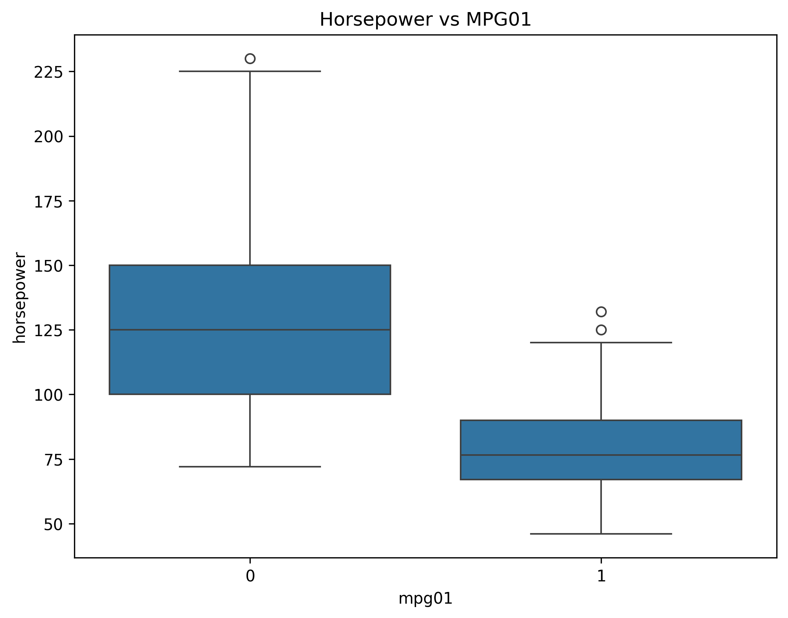
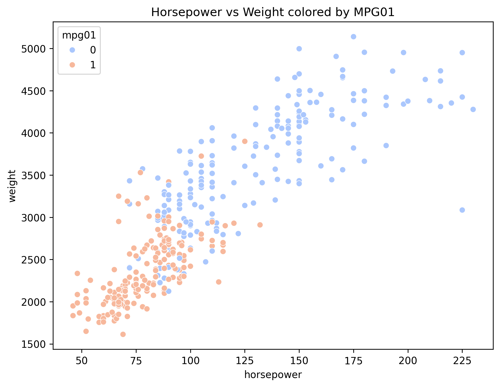
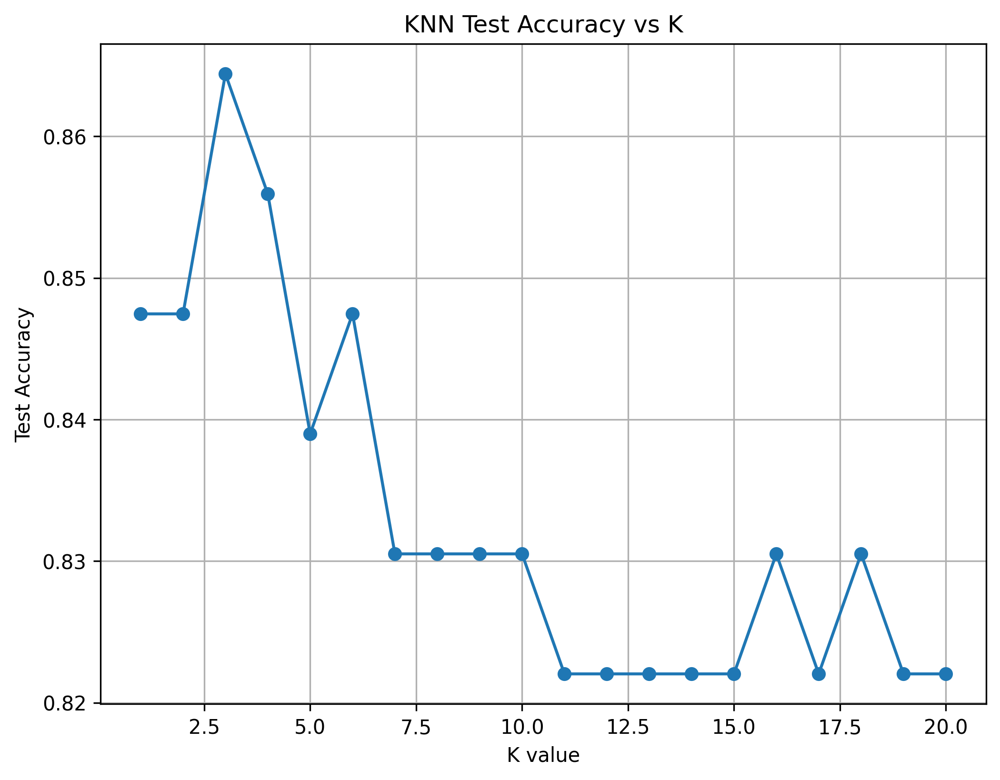

# Question 1: Auto Dataset Classification Analysis

## Objective
Predict whether a car gets high or low miles per gallon (MPG) using LDA, QDA, Logistic Regression, Naive Bayes, and K-Nearest Neighbors, following the same local data and plotting conventions as Q2 and Q3.

## Data preparation
- Data source: local copy at `Q1/data/Auto.csv` (ISLR Auto dataset, cleaned by dropping rows with `?`).  
- Target: `mpg01` where `1` indicates MPG above the dataset median and `0` otherwise.  
- Predictors used: `horsepower`, `weight`, `displacement`, `acceleration`.  
- Train/test split: 70/30 with `random_state=42`.  
- Plots saved to `Q1/plots/` using 300 DPI and tight bounding boxes.

## Exploratory analysis
  
Figure 1: Boxplot of horsepower by MPG category; lower horsepower associates with higher MPG.

  
Figure 2: Boxplot of weight by MPG category; lighter vehicles trend toward higher MPG.

  
Figure 3: Scatterplot of horsepower vs. weight colored by MPG01, showing separation between classes.

## Methodology
- Compared five classifiers:
  1. Linear Discriminant Analysis (LDA)
  2. Quadratic Discriminant Analysis (QDA)
  3. Logistic Regression (max_iter=1000)
  4. Gaussian Naive Bayes
  5. K-Nearest Neighbors (K = 1..20)
- Selected features based on EDA signals and ISLR guidance.
- Evaluated on the held-out 30% test set; reported accuracy and error.

## Results

### Test performance
| Model | Test Accuracy | Test Error Rate |
|---|---:|---:|
| Linear Discriminant Analysis | 83.9% | 16.1% |
| Quadratic Discriminant Analysis | 83.1% | 16.9% |
| Logistic Regression | 84.7% | 15.3% |
| Naive Bayes | 83.1% | 16.9% |
| KNN (K=3) | 86.4% | 13.6% |

### KNN across K
  
Figure 4: Test accuracy over K = 1..20; optimal at K=3.

Optional diagnostic (printed in terminal): confusion matrix for the best KNN model.

## Conclusions
- Best model: KNN (K=3) with 86.4% accuracy and 13.6% error.  
- Among parametric models, Logistic Regression performed best at 84.7% accuracy.  
- LDA ≈ QDA performance suggests roughly similar covariance structure assumptions in this feature set.  
- `horsepower` and `weight` are strong discriminators between high and low MPG classes, consistent with EDA.

## Reproducibility
- Data loaded locally from `Q1/data/Auto.csv`.  
- Random seed: 42 for the train/test split.  
- Environment: Python 3.10+, numpy, pandas, matplotlib, seaborn, scikit-learn.
